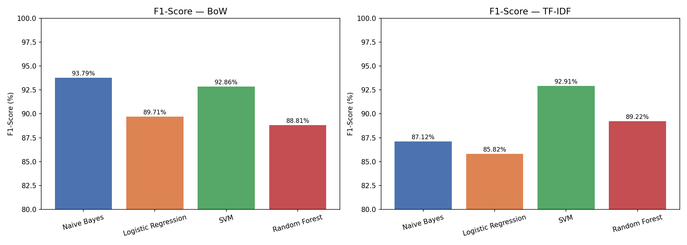
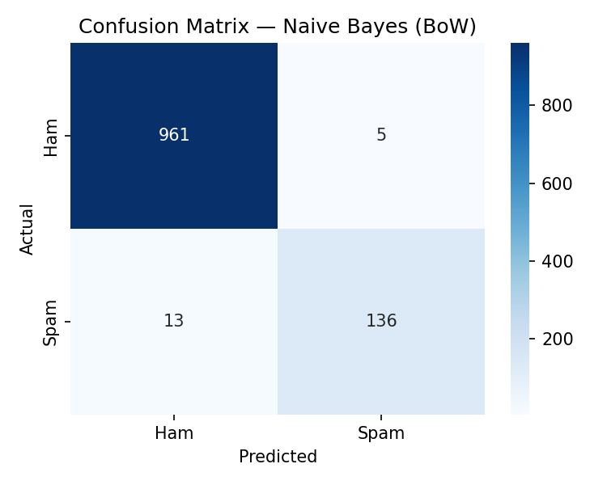

# SMS Spam Detection — Comparative Analysis of ML Classifiers

A research study comparing four machine learning classifiers across two feature extraction techniques for SMS spam detection.

📄 **Published in:** International Journal for Research in Applied Science and Engineering Technology (IJRASET), 2025


## 📌 Overview

This project evaluates the performance of **Naive Bayes, Logistic Regression, SVM, and Random Forest** classifiers using **Bag-of-Words (BoW)** and **TF-IDF** feature extraction on the SMS Spam Collection dataset.


## 📊 Results

| Feature | Classifier | Accuracy | Precision | Recall | F1-Score |
|---------|-----------|----------|-----------|--------|----------|
| BoW | **Naive Bayes** | **98.39%** | 96.45% | 91.28% | **93.79%** |
| BoW | Logistic Regression | 97.49% | 99.19% | 81.88% | 89.71% |
| BoW | SVM | 98.21% | 99.24% | 87.25% | 92.86% |
| BoW | Random Forest | 97.31% | 100.00% | 79.87% | 88.81% |
| TF-IDF | Naive Bayes | 96.95% | 100.00% | 77.18% | 87.12% |
| TF-IDF | Logistic Regression | 96.68% | 100.00% | 75.17% | 85.82% |
| TF-IDF | SVM | 98.21% | 98.50% | 87.92% | 92.91% |
| TF-IDF | Random Forest | 97.40% | 100.00% | 80.54% | 89.22% |

**Best model: Naive Bayes + BoW with F1-Score of 93.79%**


## 📈 Visualisations





## 🗂️ Dataset

- **Name:** SMS Spam Collection Dataset
- **Source:** UCI Machine Learning Repository
- **Size:** 5,572 messages (4,825 ham, 747 spam)
- **Split:** 80% train / 20% test (stratified)


## 🛠️ Tech Stack

- Python 3
- scikit-learn
- pandas
- matplotlib
- seaborn
- Jupyter Notebook


## 🚀 How to Run

1. Clone the repo
```bash
git clone https://github.com/DhruvChauh/sms-spam-detection
cd sms-spam-detection
```

2. Install dependencies
```bash
pip install scikit-learn pandas matplotlib seaborn
```

3. Open the notebook
```bash
jupyter notebook
```

4. Run all cells in order


## 🔑 Key Findings

- Naive Bayes + BoW achieves the best F1-score of **93.79%**
- TF-IDF yields perfect precision (100%) for 3 classifiers but at the cost of lower recall
- SVM is the most consistent across both feature methods (92.86% vs 92.91%)
- Random Forest underperforms despite its complexity on short text data


## 👤 Author

**Dhruv Chauhan**
Department of CSE (AI & ML), SRM Institute of Science and Technology, Kattankulathur
dc0175@srmist.edu.in


## 📜 Citation

If you use this work, please cite:
> D. Chauhan, "Comparative Analysis of Machine Learning Classifiers for SMS Spam Detection Using Bag-of-Words and TF-IDF Feature Extraction," IJRASET, 2025.
